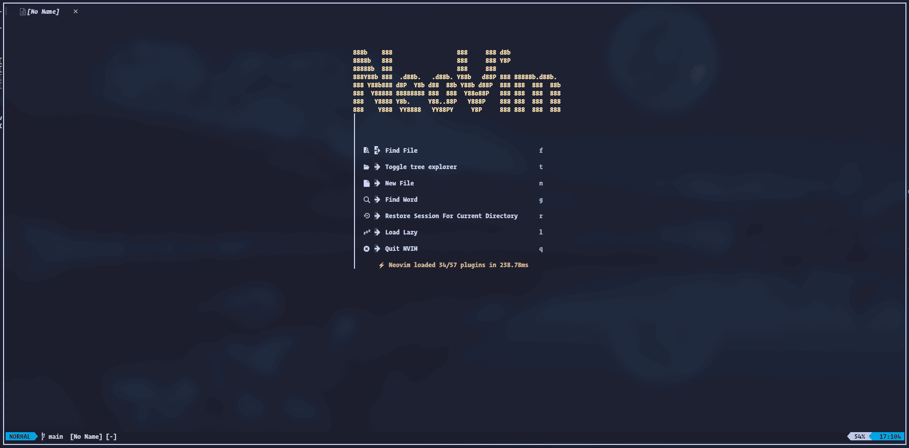
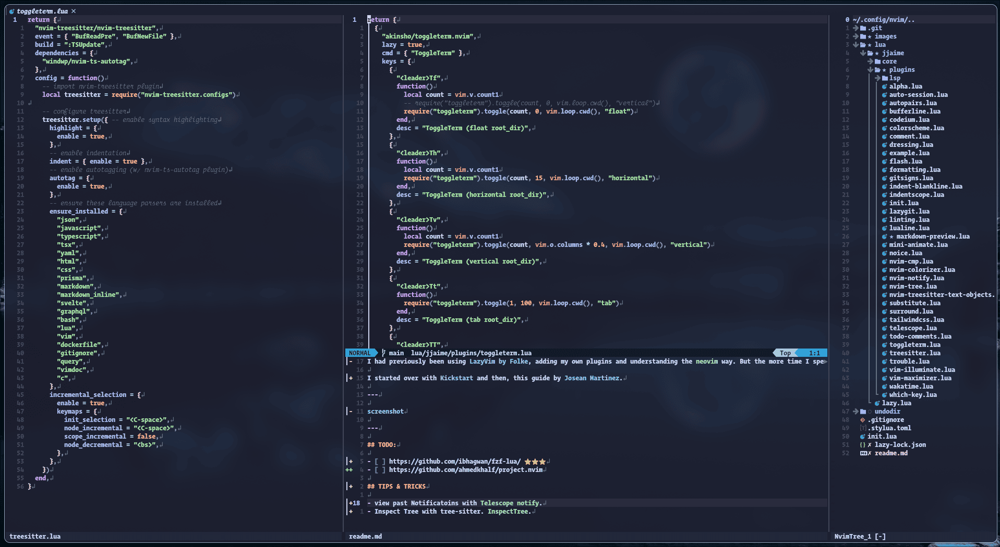
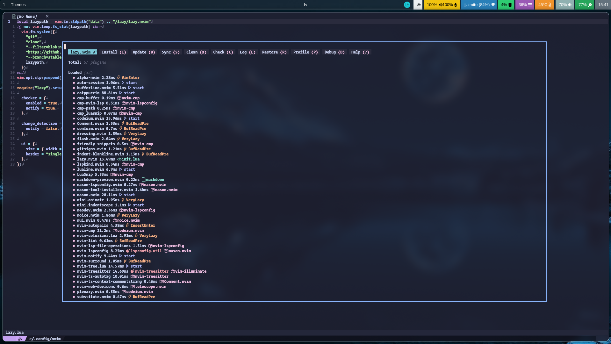

I had previously been using [LazyVim by Folke](https://www.lazyvim.org/), adding my own plugins and understanding the `neovim` way. But the more time I spend at `/r/neovim`, the more I wanted to recreate it from scratch.

I started over with [Kickstart](https://github.com/nvim-lua/kickstart.nvim/) and then this guide by [Josean Martinez](https://youtu.be/6pAG3BHurdM?si=mr4V-jd-QyoGWwXF) to get a better idea on how to structure my `nvim` configuration.

---

`dashboard`


`splits`


`lazy`


`plugins`

```sh
.
├── alpha.lua
├── autopairs.lua
├── auto-session.lua
├── bufferline.lua
├── codeium.lua
├── colorscheme.lua
├── comment.lua
├── dressing.lua
├── example.lua
├── flash.lua
├── formatting.lua
├── gitsigns.lua
├── indent-blankline.lua
├── indentscope.lua
├── init.lua
├── lazygit.lua
├── linting.lua
├── lsp
│   ├── lspconfig.lua
│   └── mason.lua
├── lualine.lua
├── markdown-preview.lua
├── mini-animate.lua
├── noice.lua
├── nvim-cmp.lua
├── nvim-colorizer.lua
├── nvim-notify.lua
├── nvim-tree.lua
├── nvim-treesitter-text-objects.lua
├── substitute.lua
├── surround.lua
├── tailwindcss.lua
├── telescope.lua
├── todo-comments.lua
├── toggleterm.lua
├── treesitter.lua
├── trouble.lua
├── vim-illuminate.lua
├── vim-maximizer.lua
├── wakatime.lua
└── which-key.lua
```

---

## TODO:

- [ ] https://github.com/ibhagwan/fzf-lua/ ⭐️⭐️⭐️
- [ ] https://github.com/ahmedkhalf/project.nvim

---

I know some of the keymaps don't really make sense to others, but they work for me. A neovim config SHOULD be a personal project 👍
